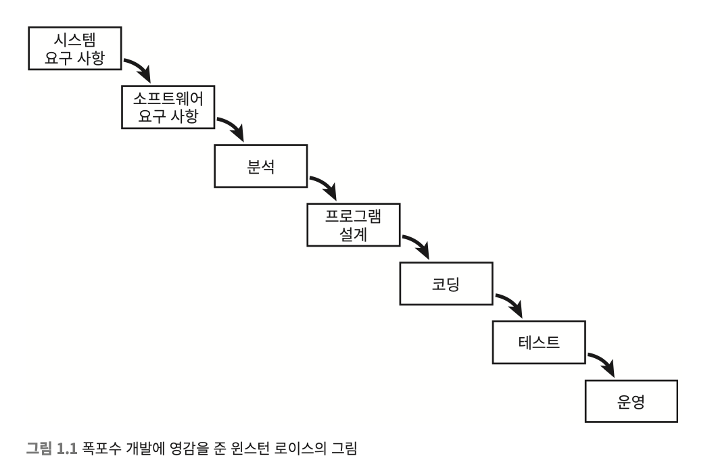

# 1장 애자일 소개

## 애자일의 소개
 * 애자일은 17명의 프로그래머가 모여서 작성한 선언문이다.
 * 소프트웨어 개발 프로세스를 개선하기 위한 목적으로 작성하였다.
 * 하지만 시간이 지나면서 애자일에 대한 오해가 생기게 되었고, 이에 애자일의 핵심을 소개하고자 저자는 글을 책을 쓰게 되었다.
 
## 애자일의 역사
애자일의 방법은 너무나 자연스럽기 때문에 인류가 아마 오래전부터 사용해왔던 방식이 아닐까 추측한다.
하지만 많은 산업분야에서 과학적 관리라는 개념이 퍼지게 되었고 많은 부분이 애자일과 상충한다.

### [과학적 관리(테일러리즘)](https://ko.wikipedia.org/wiki/과학적_관리법)
 * 과학적 관리는 방대한 계획을 기반으로 가장 최적의 방법을 알아낸뒤 하급자에게 계획대로 모든 일을 정확하게 수행하기를 지시하는 방법이다.
 * 그렇기 때문에 문제가 잘 정의되며, 목표가 구체적이고, 변경되지 않는 프로젝트에 적합하다.
 * 1970년대에는 무엇이 가장 좋은 소프트웨어 개발방식인가에 대해서 논의되지 않았고 "윈스턴 로이스의 대규모 프로젝트 관리"라는 논문을 통해서 워터폴(폭포수) 모형이 처음으로 제시되었고, 소프트웨어 업계는 폭포수 모형이 표준처럼 자리잡게된다.
   * 물론 해당논문은 폭포수보다 더 좋은 방식을 제안하기 위한 논문이었으나...... 
 * 폭포수 모향을 통한 과학적 관리를 할 수 있을거라는 믿음이 있었다.

 * 이런 폭포수 모형은 30년이 넘도록 인기를 끌었고 대부분 분석과 디자인 단계에서는 문제 없어보이나 코딩 단계에서는 대부분 계획대로 되지 않는 경우가 너무 많았다.
   * 폭포수 모델이 얼마나 인기를 끌었는지는 당시 출간됐던 책인 "구조적 분석과 구조적 설계" 그리고 "객체지향 분석과 객체 지향 설계"와 같이 분석과 설계와 관련된 유명서적들이 많이 출간되었던것으로 알 수 있다.

### 애자일 선언문
 * 애자일 선언이 있기전 선-애자일 이라는것이 있었는데 이것은 과학적 관리와 다르게 조금씩 진행해보고 측정하며 계획의 진로를 수정하여 원하는 결과에 도달할 수 있도록 하는 방법이었다.
 * 하지만 80-90년대의 몇몇 프로그래머들이 기존 폭포수 모형에 도전하게 되었고 XP나 TDD와 같은 기법이 탄생하며 애자일의 기초를 마련하였다.
 * 이후 17명의 개발자가 스노버드에 모여서 만들어 낸것이 애자일 선언문이다.

#### 애자일 선언문의 핵심내용
 ```
 공정과 도구보다 개인과 상호작용
 포괄적인 문서보다 작동하는 소프트웨어
 계약 협상보다 고객과의 협력
 계획을 따르기보다 변화에 대응하기
```
 * 이 외에도 내용이 있지만 일단 핵심은 위의 내용으로 볼 수 있다.
 * 애자일 선언문은 [링크](http://agilemanifesto.org)에서 확인가능

## 애자일 개요
### 철십자와 애자일
 * 모든 프로젝트는 철십자에 의해서 제약을 받는다.
 * 철십자란 좋음, 빠름, 저렴함, 완성 중에 셋만 선택가능한것을 말한다.
 * 모두 가질 수 없으며 적절하게 절충해야한다.
 * 좋은 프로젝트 관리라는 것은 상황에 따라 네가지 속성의 가중치를 적절하게 조절하는것을 말한다.
   * 필요한 만큼 좋으며, 필요한 만큼 빠르고, 필요한 만큼 저렴하며, 필요한 만큼 완성되도록한다.
 * 애자일은 이러한 관리를 추구한다. 애자일이 생산하는 데이터를 활용하면 이러한 가중치를 판단하는데 도움을 줄 수 있다는 말이다.
 * 예를들면 애자일의 스토리 포인트가 그러한 방식이다.
   * 스토리 포인트란 해당일을 처리하는데 얼마나 많은 비용이 들어가는지를 포인트화 해서 할당하고 한주기(1~2주) 동안 얼마나 많은 스토리포인트를 해결했는가로 속도를 측정하는 방법이다.
 * 이러한 스토리 포인트를 활용하면 팀의 속도를 측정할 수 있으며 이러한 속도를 기반으로 마일스톤의 달성일정을 대략적으로 추정하는것이 가능하다.
 * 따라서 에자일을 통해서 프로젝트에 대한 데이터를 생산하고 프로젝트 관리자는 철십자의 가중치를 조절할 수 있어야한다.
 * 참고할 만한 링크 1 : https://en.wikipedia.org/wiki/Project_management_triangle
 * 참고할 만한 링크 2 : https://medium.com/@abderrahim.benmakhlouf/the-iron-cross-what-i-just-learnt-3-ec3e09bf3d7c
 * 대부분의 경우 프로젝트의 일정은 합당한 비지니스 적인 사유로 고정되어있는 경우가 많다. 하지만 고객은 대략적인 목표는 있지만 구체적인 세부사항까지는 모르는 경우가 많기 때문에 요구사항은 자주 변경된다.
 * 즉 마감기한은 정해져있지만 요구사항이 계속 변경되는것이 소프트웨어 프로젝트이다.

### 폭포수 방식 프로젝트
 * 폭포수는 크게 분석, 설계, 구현의 단계로 나뉜다.
 * 각 단계별로 목표 일정이 정해져있다.
 * 분석과 설계에서 대략적으로 요구사항을 정리하고 설계에서도 계획을 구채화한다.
 * 다만 분석과 설계가 완료된 뒤에도 실제로 완료되었는지 검증하는 것은 불가능하다. 왜냐하면 실제로 구현을 통해 검증하지 않았기 때문이다.
 * 구현단계로 들어가면 실제 문제가 발생한다. 분석과 설계단계에서 진행했던 일들이 실제 구현단계에서 맞지 않을수 있고 구현단계에서 고객의 요구사항이 바뀔수도 있다.
 * 대부분 일정이 꼬였음을 구현단계에서 느끼지만 이미 늦었다. 
 * 하지만 대부분은 분석과 설계가 부족했다 라고 치부하며 다음에는 분석과 설계를 완벽히 하자 라고 다짐한다고 한다.

### 애자일 방식 프로젝트
 * 애자일은 1~2주단위의 스프린트를 통해서 프로젝트를 진행한다.
 * 프로젝트가 시작되는 반복주기0에서는 초기 스토리를 작성하고 개발환경을 셋팅하고 대략적인 계획을 세운다.
 * 0단계가 끝나면 예상보다 적은수의 스토리가 생산되지만 중요하지 않다. 이것은 프로젝트의 평균속도를 추정하는데 사용하기 위한 계획이다.
 * 그리고 1주기를 시작하고 스토리 포인트를 처리한다.
 * 1주기동안 처리된 스토리포인트를 통해서 일주일동안 처리할 수 있는 포인트를 추정하고 속도를 계산하는것이 가능해진다.
 * 그리고 이후 주기를 계속 반복하며 추정치를 조정하고 데이터에 기반하여 프로젝트의 일정은 점점더 현실 적으로 조정이 가능하다. 
 * 그리고 관리자는 이러한 데이터를 통해 철십자를 조정한다.

위에 예시에서 보듯 과학적 관리에 기초한 폭포수 모형의 경우는 애자일에 비해서 소프트웨어 개발과 어울리지 않는다는것을 확인할 수 있다.  
이는 과학적 관리가 전문적인 지식과 역량이 요구되는 일에는 부적합하고, 소프트웨어의 변화에 쉽게 대응하지 못하기 때문이다.

### 철십자 관리하기
 * 일정 조정
   * 종료일자는 일반적으로는 협상이 안되는 경우가 많다. 협상이 가능하더라도 일반적으로는 비지니스 적으로 손실이 일어날 수 있다.
 * 추가 직원 투입
   * 브룩스의 법칙에 따르자면 늦어지는 프로젝트에 인원을 투입하면 더 늦어지게된다.
   * 왜냐하면 신규직원이 프로젝트를 파악하기 위해 기존 직원들의 리소스를 소모하기 때문이다.
   * 프로젝트에 여유가 있다면 장기적으로 지원을 투입하는것은 좋다.
   
 * 품질 목표 조정
   * 품질을 낮추면 단기적으로는 빠르게 진행되는것처럼 느껴진다.
   * 하지만 낮아진 품질은 결과적으로 프로젝트의 전체적인 진행속도를 낮추게된다.
   * 빠르게 가는 유일한 방법은 제대로 가는 것이다.
 * 범위 목표 조정
   * 방법이 없을경우 범위는 타협이 가능하다.
   * 합리적인 데이터를 기반으로 일정내에 가능한 핵심 기능을 도출하여 제안하여 조정하자.
결과적으로 범위를 줄이는것이 가장 합리적일 수 있다.
프로젝트를 진행하며 반드시 필요한 기능을 우선순위로 두어 개발하도록하자.

## 삶의 순환 (Extreme programming : XP)

 * XP는 애자일을 실천하는 가장 잘 정의된 방법이라고 저자는 주장하고 있다.
 * XP는 세 개의 고리로 나눠지는데 다음과 같다.

### 가장 밖 고리 : 프로젝트를 관리하면서 지켜야할 원칙
    * 계획 게임
        * 프로젝트를 기능, 스토리, 작업으로 쪼개는 방법을 설명
        * 크기 추정, 우선순위 결정, 작업일정에 대한 지침 제공
    * 작은 릴리즈
        * 팀의 일을 작은 단위로 나눠 하도록 한다.
    * 인수 테스트
        * 기능이나 스토리의 완료를 정의할 수 있게 한다.
    * 전체 팀
        * 소프트웨어 개발팀이 여러가지 역할로 나눠져있음을 정의
        * 팀을 이루는 프로그래머, 테스터, 관리자는 같은 목표를 공유한다.

### 중간 고리 : 팀과 관련된 실천 방법. 의사소통 원칙과 체계
    * 지속 가능한 속도
        * 지속가능한 정도로 일을 해야함
        * 야근하다보면 결국 제대로 일을 진행할 수 없게된다.
    * 공동 소유
        * 프로젝트안에서 칸막이를 치지 않도록한다. 지식은 공유되어야한다.
    * 지속적 통합
        * 피드백을 자주 받을수 있는 시스템을 만들어라. (CICD를 통한 지속적 통합과 배포의 개념)
    * 메타포
        * 사업부서와 개발부서가 소통할때 하나의 어휘를 사용하도록 하는것.
        * 이 부분에 대해서는 도메인주도 설계 원칙과 같은 원칙으로 보여진다.

### 가장 안쪽 고리 : 프로그래머가 기술적 품질을 높게 유지하는 방법
    * 짝 프로그레밍
        * 기술팀이 지식을 공유하고, 리뷰하고, 협력하도록 하여 정확성을 끌어냄.
        * 단순히 짝프로그래밍 외에도 코드리뷰 등이 포함될 수 있을것.
    * 단순한 설계
        * 노력을 낭비하는 것을 방지해줌
        * 캔트백이 클린코드에서 주장한 내용에 따르자면
            * 모든 테스트를 수행한다.
            * 중복을 없앤다.
            * 프로그래머의 의도를 표현한다.
            * 클래스와 메소드 수를 최소로 줄인다. (필요한만큼만 만들어라)
    * 리펙터링
        * 모든 작업결과물은 더욱 좋은 방향으로 개선되는 것이 장려됨
    * 테스트 주도 개발
        * 최고의 품질을 유지하며 빠른속도로 작업되도록 도와준다.

이러한 고리는 애자일의 다음과 같은 요소를 반영한다.
* 공정과 도구보다 개인과 상호작용
    * 전체 팀, 메타포, 공동 소유, 짝 프로그래밍, 지속 가능한 속도
* 포괄적인 문서보다 작동하는 소프트웨어
    * 인수 테스트, 테스트 주도 개발, 단순한 설계, 리팩터링, 지속적 통합
* 계약 협상보다 고객과의 협력
    * 작은 릴리스, 계획 게임, 인수 테스트, 메타포
* 계획을 따르기보다 변화에 대응하기
    * 작은 릴리스, 계획 게임, 지속 가능한 속도, 테스트 주도 개발, 리팩터링, 인수 테스트