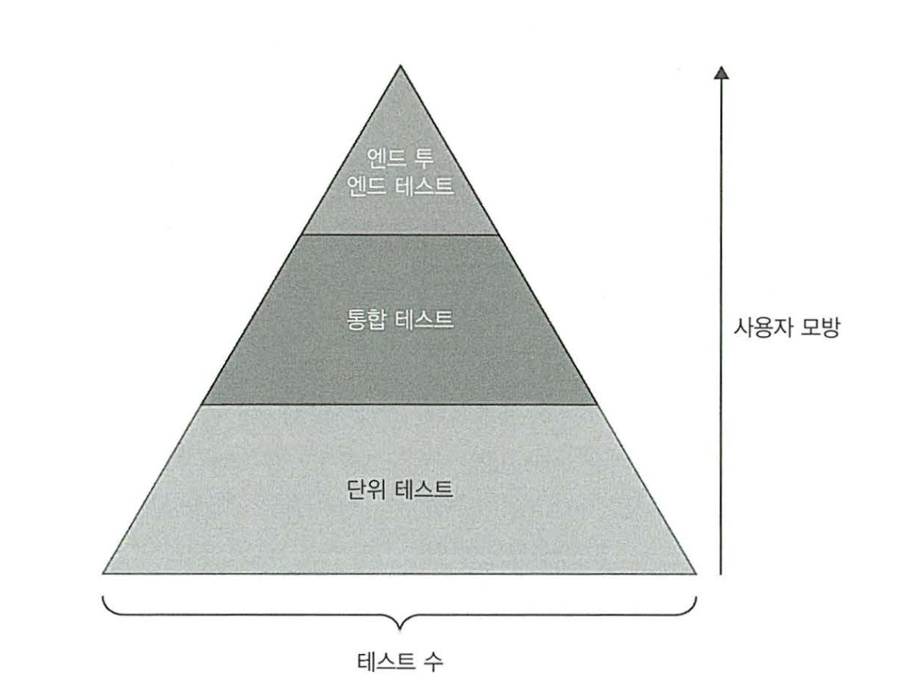

# 4장 좋은 단위 테스트의 4대 요소
## 좋은 단위 테스트의 4대 요소

들어가기전에..
저자는 책에서 테스트 점수라는 용어를 사용하고 있다.
즉 해당 테스트가 얼마나 가치가 있는지를 평가하는 점수를 말한다.
테스트 점수에 대한 지표는 각각 회귀방지, 리팩토링 내성, 빠른피드백, 유지 보수성 이 있으며
각 테스트중 하나라도 0점이라면 테스트로서는 가치가 없다고 판단한다.
즉 테스트의 총점이 4가지 지표를 모두 곱한 값으로 나타낸다고 본다.
각 테스트 지표의 최저점은 0점이며 최고점은 1점이다.

즉 테스트 점수의 계산식은 다음과 같다.
"회귀방지" * "리팩토링 내성" * "빠른 피드백" * "유지 보수성" <= 1

- 회귀(버그) 방지
    - 좋은 테스트는 버그를 찾아낼 수 있어야한다.
    - 코드가 많아 질수록 버그가 발생할 확율은 높아진다.
    - 회귀방지에 대한 점수는 다음학목으로 축정할 수 있다.
        - 테스트 중에 실행되는 코드의 양
            - 코드가 많을수록 회귀가 발생할 확율이 높으므로 테스트의 가치가 올라간다.
        - 코드 복잡도
            - 코드가 복잡할수록 회귀가 발생할 확율이 높으므로 테스트의 가치가 올라간다.
        - 코드의 도메인 유의성
            - 코드의 비지니스 로직을 나타내는 코드를 테스트하는 것이 회귀방지에서는 더욱 좋은 점수를 줄 수 있다.
            - 도메인이 복잡하지 않아 실수할 여지가 없는 단순한 코드를 테스트 하는것은 테스트 코드로서 가치가 크게 없다.
                - 예> getter, setter 함수
    - 무엇보다도 라이브러리, 외부시스템, 프레임워크 등도 모두 포함시켜 많은양의 코드를 테스트할때 테스트의 회귀방지로서의 가치가 높아진다.
    - 회귀가 발생했음에도 테스트가 성공하는 것은 *거진 음성*이다

- 리펙터링 내성
    - 리팩터링 내성은 베이스코드를 리팩토링 하더라도 유닛테스트가 실패하지 않아야하는 지표이다.
    - 리펙터링에 대해서 유닛테스트의 영향도가 없을때 리팩터링 내성에 대한 테스트 점수를 높게 줄 수 있다.
    - 리펙터링을 해서 기능은 고장 나지 않았지만 유닛테스트가 실패하는 경우를 *거짓 양성* 이라고 한다.
    - 리펙터링 내성이 중요한 이유
        - 테스트는 기능이 고장 났을때에 대한 조기경보기 이다.
        - 그런데 이런 조기경보기가 빈번하게 *거짓 양성*을 만들어 낸다면 테스트는 점점 신뢰가 떨어지게 될것이다.
            - 결국 프로그래머들이 방해만 된다며 테스트 실패를 무시하거나, 테스트를 지워버리는 극단적인 상황까지 갈 수 있다.
        - 또한 거짓 양성이 발생할것이라는 생각 때문에 리펙터링을 주저하게 되고 코드베이스는 점점 나빠진다.
    - 거짓 양성은 구현 세부사항에 많이 결합될수록 자주 발생한다.
        - 테스트는 세부사항에 결합되지 않도록 식별할 수 있는 동작에 대한 테스트를 해야한다.
        - 테스트 작성시에는 항상 화이트 박스 테스트가 아닌 블랙 박스 테스트로 진행되어야한다.
            - 내부 동작에 대해서는 완전 모른체 SUT가 얻어야 하는 동작에만 초점을 맞춰 테스트를 작성해야한다는 이야기다.

- 빠른 피드백
    - 빠른 피드백은 단위테스트의 빠른 수행한다와 똑같은 말이다.
        - 자주 실행되서 피드백을 자주 받을 수 있다는 의미.
    - 느린 테스트는 개발중에 자주 실행하지 못하기 때문에 버그를 늦게 발견할 확율이 높아지며 버그 수정비용을 높히게됨.

- 유지 보수성
    - 테스트 코드 또한 제품코드 만큼 중요한 코드로 유지보수성을 똑같이 취급해야한다.
    - 테스트가 항상 실행 될 수 있도록 테스트 실행 인프라에 대해서도 항상 관리가 되어야한다.

## 회귀 방지와 리펙터링 내성의 관계

### 테스트 정확도
- 테스트의 정확도 지표는 다음 두가지 요소로 구성됨.
    - 테스트가 거짓음성을 제외하고 버그가 있음을 얼마나 잘 나타내는가?
    - 테스트가 거짓양성을 제외하고 버그가 없음을 얼마나 잘 나타내는가?
- 테스트의 정확도는 신호비율 측면에서 나타낼수도 있음
    - 테스트 정확도 = 신호(발견된 버그 수)/소음(허위 경보 발생 수)
    - 즉 테스트를 통해 발견된 버그중 허위 경보수가 적을 수록 테스트의 정확도가 올라간다는 의미이다.
- 테스트가 양성이 되었을때 거짓양성이라면 정확도가 떨어진다고 볼 수 있다. (= 리팩터링 내성이 부족함)
- 테스트가 음성이 되었을때 거짓음성이라면 정확도가 떨어진다고 볼 수 있다. (= 회기 방지가 부족함)
- 따라서 리펙터링 내성과 회귀방지는 테스트의 정확도에 영향을 준다.

### 거짓 양성과 거짓 음성의 중요성
- 거짓 양성은 프로젝트가 성장할 수 록 테스트 스위트에 큰 영향을준다.
    - 왜냐하면 프로젝트 초기에는 리팩터링을 할일이 적기 때문에 거짓 양성이 상대적으로 중요하지 않다.
    - 하지만 시간이 흐륵수록 코드 베이스가 나빠져 리펙터링을 해야할때 거짓 양성은 큰 걸림돌이 될 수 있다.
    - 또한 테스트의 신뢰도를 떨구게 되어 아무도 신경쓰지 않는 경고가 될 수 있다.
- *거짓 양성도 거짓 음성만큼 신경 써야한다.*

## 이상적인 테스트란 무엇인가!
- 테스트 점수를 최대로 할 수 있어야한다.
- 최소 필수 값에 대해서 높은 임계치를 설정한뒤 임계치를 넘지 못하는 테스트는 모두 제거한다.
- 테스트점수
    - 테스트점수를 1로 하는것은 불가능하다.
        - 회귀방지, 리팩터링 내성, 빠른피드백이 상호 배타적이기 때문이다.
    - 또한 하나라도 0점을 받은 테스트는 가치가 없다.
- 테스트 점수에서 리팩터링 내성과 유지보수성은 항상 점수를 최대로 해야한다.
    - 리펙터링 내성은 위에서 설명한대로 망가지면 신뢰도와 코드 베이스를 수정할 수 없게 만들기 때문이다.
    - 또한 리펙터링 내성은 조금만 인정되지 않는다. 없거나 있거나 (0점 아니면 1점)
    - 유지보수성은 3가지 지표와 독립적이므로 항상 최대로 유지해야한다.
- 결국 회귀방지와 빠른 피드벡사이에서 조율해가며 테스트를 만들어야한다.

- 상호 배타성에 대한 설명
    - 빠른 피드백 점수를 최대로 하기 위해 외부 종속성을 Test Dobule로 대체함.
        - Test Double 때문에 회귀방지 점수가 최대가 되지 않음.
    - 회귀 방지 점수를 최대로 하기 위해 화이트 박스 방식으로 테스트를 작성함.
        - 테스트가 제품코드에 결합되기 때문에 리팩터링 내성이 떨어짐.
    - 리팩터링 내성 점수를 최대로 하기위해 엔드투엔드 테스트를 수행함.
        - 외부종속성을 모두 포함하기 때문에 빠른 피드백 점수가 떨어지게됨.

- 이상적인 테스트는 어떤 어플리케이션에서 어떤 테스트를 하냐에 따라 달라짐.
    - 단위테스트 피라미드라는 것이 있다.
        - 
        - 일반적으로 단위 테스트, 통합 테스트, 엔드투엔드 테스트 순으로 테스트가 적어진다.
        - 상단은 회귀방지, 하단은 실행속도가 강조된다.
        - 띠리서 테스트에 따라 회귀방지와 실행속도의 점수를 조절한다.
        - 리팩터링 내성은 0점 아니면 1점이라 무조건 1점이 되어야 하기때문에 타협하지 않는다.
    - 예외도 있다.
        - 어플리케이션에 복잡한 비즈니스 규칙이 없는 CRUD만 있는 경우 통합테스트가 더욱 가치가 있다.
        - 외부의존성이 없거나 하나만 연결된경우 엔드투엔드 테스트와 통합테스트의 속도차이가 나지 않는다.
    - 위 내용을 고려하여 테스트를 선정하고 본인의 프로젝트에 맞게 회귀방지와 실행속도간의 점수를 조절해야한다.

## 블랙박스 테스트와 화이트박스 테스트
- 블랙박스 테스트
    - 제품코드가 어떻게 생겼는지 모르는 상태로 진행하는 테스트
- 화이트박스 테스트
    - 제품코드에 대해 모두 알고 있다는 전제로 진행되는 테스트
- 대부분의 경우 블랙박스테스트 방식으로 진행할것.
    - 화이트박스 테스트는 제품코드와의 결합도를 높히기 때문에 깨지기 쉬움.
- 화이트박스 테스트는 테스트 알고리즘 복잡도가 높은 유틸리티 코드의 경우만 사용할것.
- 테스트 분석 시 화이트 박스 기법으로 분석하고, 테스트 작성 시 블랙박스 혁싱으로 작성하면 효과적이다.

## 개인적인 정리
- 이번장에서는 단위테스트가 아닌 테스트 전반에 대해서 말하고 있다.
- 좋은 테스트의 조건이 대부분 비슷하고 어떤 요소에 가중치를 좀더 줄지만 자르게 책정한다.
- 단위테스트는 자주 실행하며 빠른 피드백을 받는것이 회귀방지 보다 중요하다는 것이 조금 이해가 안갔다.
    - 하지만 단위테스트는 상대적으로 적은 테스트를 수행하는 것이고, 
      외부의존성을 제외하기 때문에 통합테스트나 엔드투엔드 테스트에 비해 회귀방지 지표로서의 가치가 떨어진다는 것으로 이해하면 좋다.
- 리펙터링 내성에 대해서는 공감이 많이 갔다.
    - 실제로 2016년도 쯤 자사 SDK에 유닛테스트가 있었지만 리펙터링 내성이 엉망인데 커밋하면 Jenkins에서 맨날 실패를 주고 빌드가 진행 안되도록 막아놓으니..
      다음 스탭으로 진행이 안되서 결국 유닛테스트를 Jenkins에서 빼버린 이력이 있다.
    - 유닛테스트는 리펙터링 내성이 정말 중요하다.. 코드를 좋게 고치려고 건들기 시작했는데 유닛테스트가 계속 실패를 준다면 생산성도 안나오고.. 유닛테스트도 처음부터 다시 짜야하니..
    - 결과적으로 테스트는 중요한 동작단위에 대해서 최종사용자가 변하지 않는 인터페이스를 사용한다는 입장에서 작성하면 충분할듯..
    - 또한 리펙터링 내성은 테스트를 작성하거나 코드베이스를 개선하는데 큰 걸림돌이 되므로 단위테스트 작성 시 아주 많이 신경써야한다.
- 빠른 피드벡에 대해서는 단위테스트에서 중요도가 높은거지 통합테스트나 엔드투엔드 테스트에서는 어쩔수 없이 느려지기 때문에 빠른 피드벡에 대한 가치 정도는 테스트에 따라 달라지는것.
- 이번 장에서 결론적으로 테스트를 작성할때 신경써야하는 항목과 신경써야하는 항목의 우선순위를 배운것같다.
- 빠른 피드백에서 어느정도로 느려야 0점을 받을 수 있는건지 기준이 모호하긴 하다.
    - 빠른 피드백의 경우 테스트 별로 타협하여 점수를 먹여야하는 지표인것으로 보여진다.
    - 단위테스트에서 너무 많은 외부종속성을 갖고있어 바로 수행이 불가하면 빠른 피드백 점수는 0점
    - 엔드투엔드 테스트의 경우 당연히 외부종속성이 있어 느리지만 관리 되지 않는 종속성이 있어 엔드투엔드 테스트 수행을 위해 종속성에 대한 유지보수부터 해야한다면 빠른 테스트 점수는 0점
    - 어디까지나 수행하는 테스트에 맞추어 점수를 주어야하는 항목인듯.
- 빠른 피드백이 있으면서, 리팩터링 내성이 우수하고, 회귀 방지를 잘하는 코드는 정말 없는것일까?
    - 결론적으로 모두를 만족하는 이상적인 방식은 없고 상황에 따라 여러가지 테스트 방식을 조절해가며 써야한다는 이야기인듯하다.
    - 물론 해서는 안되는 방식도 있다.
    - 해서는 안되는 방식 = 리팩터링 내성을 포기하는 방식
        - 회귀 방지를 최대한 끌어내는 최적의 방법으로 화이트 박스 방식으로 테스트를 작성해서 한줄만 잘못되더라도 양성상태로 만들어 줄 수 있을것이다.
            - 하지만 리팩터링 내성은 매우 떨어지게된다.