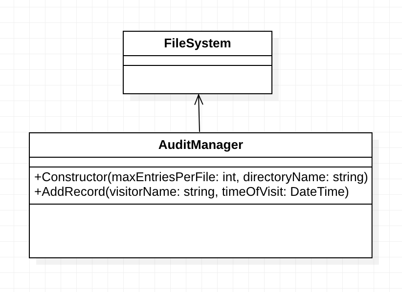
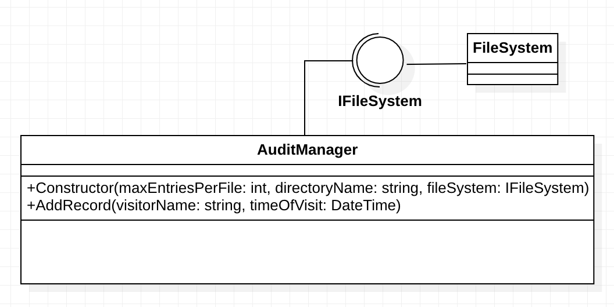
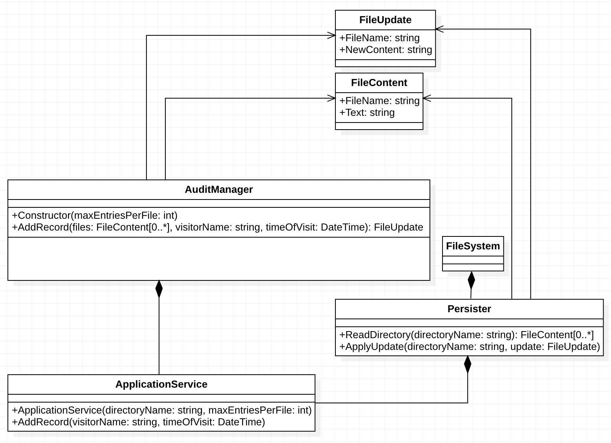

# 단위 테스트 스타일
이 장에서는 함수형 아키텍쳐를 설명하고 출력기반의 테스트가 어떻게 함수형 아키텍쳐와 연관되어있는지 설명한다.
결론적부터 말하면 테스트하고자 하는 대상이 출력이 존재하고 입력에 대한 출력이 항상같다면 리펙터링내성과 유지보수성이 매우 좋아진다.

## 단위 테스트 스타일의 이해
### 단위 테스트의 세가지 스타일
단위테스트에는 세가지 스타일이 존재한다.
- 출력 기반 테스트 (output-based testing)
    - SUT에 입력값을 넣고 생성된 출력값을 검증한다.
    - SUT가 사이드이팩트를 만들지 않아야만 적용가능하다.
    - 함수형 이라고도한다.
- 상태 기반 테스트 (state-based testing)
    - 작업이 완료된후 시스템의 상태를 확인하는 방식이다.
    - SUT 혹은 협력자의 상태를 확인한다.
- 통신 기반 테스트 (communication-based testing)
    - 목을 사용해 SUT와 협력자간의 통신을 검증하는 방식이다.

### 스타일별 테스트 지표의 점수
- 여기서 테스트 지표의 점수는 4장에 나왔던 그 점수다.
- 회귀방지는 테스트 스타일에 따라 지표 점수가 달라지지 않는다. 왜냐하면 테스트하고자 하는 코드에 의해 지표 점수가 달라지기 때문이다.
    - 단 통신기반에서 조금 예외가 있을 수 있는데 목을 남용할 경우 회귀 방지가 되지 않을 수 있다는 부분이다. (책에서는 극단적인 사례라고한다.)
- 테스트가 외부 의존성과 떨어져있다면 실행속도는 거의 동일하다. 따라서 점수가 차이나지 않는다.
- 리팩터링 내성과 유지보수성에서는 차이가 발생한다.
- 리팩터링 내성
    - 리팩터링 내성은 있거나 없거나의 점수이기 때문에 여기서는 각 테스트가 리팩터링 내성이 없어질 확율 정도로 생각하는 것이 좋을것같다. 즉 얼마나 적은 노력으로 리팩터링 내성을 유지 할 수 있는가.
    - 출력 기반 테스트
        - SUT의 메서드에만 결합하므로 리팩터링 내성을 보장하기가 가장 쉽다. 제품코드와 결합도가 가장 낮기 때문이다. (sut의 메서드의 출력하고만 결합함.)
    - 상태 기반 테스트
        - SUT와 협력자의 상태가 노출되어야 하기 때문에 구현의 세부사항과 결합할 확율이 높다 따라서 상대적으로 리팩터링 내성을 위해 노력을 더욱 기울여야한다.
    - 통신 기반 테스트
        - 목을 통해 테스트를 수행하기 때문에 프로세스 외부 종속성이 아닌 이상 리팩터링 내성을 유지하는데 많은 노력이 든다.(5장 참조)
- 유지 보수성
    - 출력 기반 테스트
        - SUT 메서드의 멱동성이 보장되는 출력만을 테스트 하기 때문에 테스트 코드가 간결하여 유지보수성이 높다.
        - 출력의 멱동성이 보장된다는 것은 프로세스 외부 의존성을 다루지 않는 다는 것이기 때문에 유지 보수성이 높다. (외부 의존성을 목으로 대체하거나 실행환경에 대한 유지보수가 없기 때문에 유지보수성이 높다.)
    - 상태 기반 테스트
        - SUT와 여러 협력객체의 상태를 체크해야하기 때문에 유지보수성이 나쁘다.
        - 결과적으로 출력 기반 테스트보다 테스트를 위한 더 많은 코드가 사용되기 때문에 유지보수성이 나쁘다.
    - 통신 기반 테스트
        - 목으로 인해 테스트를 위한 코드가 커지기 때문에 유지보수성이 가장 나쁘다.

### 결론
|   |출력기반|상태기반|통신기반|
|---|---|---|---|
|리팩터링 내성을 위한 노력|낮음|중간|중간(책에서는 중간이지만 높음이 아닐까?)|
|유지비|낮음|중간|높음|   

따라서 가능한 출력 기반의 테스트 선호하도록 해야한다.

## 함수형 아키텍쳐
### 함수형 프로그래밍
- 함수형 프로그래밍은 수학적 함수(Methematical function) 를 사용한 프로그래밍이다.

### 수학적 함수
- 수학점 함수는 숨은 입출력이 없는 함수다.
    - 숨은 입출력이 없다는 것은 메서드이름, 인수, 반환타입이 모두 명시되어있다는 의미이다.
- 숨은 입출력이 없기 때문에 입력에대한 출력이 항상 동일하다. (멱등성이 보장됨.)
    - 여기서 함수에 명시되어 있다는 것은 함수의 선언 시그니처를 말함
        - ex> int add(int x, int y); (출력, 함수이름, 입력)
- 즉 참조 투명성이 보장되는 함수이다.
    - 프로그램 동작의 변경없이 관련 값을 대체할 수 있다면 표현식을 참조 상 투명하다고 할 수 있다.
    - 결국 위랑 같은의미 숨은 입출력이 없고 시그니처에 명시한 값으로만 연산을 하기 때문에 부수효과가 없고 항상 같은 값을 돌려줌.
- 수학적 함수는 함수 실행으로 인한 부수효과(사이드이팩트)가 일어나지 않기 때문에 이를 테스트 할 경우 테스트가 짧고 간결하며 이해하기 쉽고 유지보수성이 좋다.
- 수학적 함수 = 순수 함수

### 비순수 함수
- 순수함수의 정의에 반하는 함수이다.
- 숨은 입출력으로 인해 코드테스트를 하기 힘들게 한다.
- 숨은 입출력의 유형에는 다음과 같은 유형이 있다.
    - 사이드 이팩트
        - 함수실행으로 함수에 표시되지 않은 출력이 발생된다.
        - 파일출력, 클래스 인스턴스 상태 변경 등..
    - 예외
        - 함수 선언 시그니처에 명시되지 않은 출력을 발생시키므로 숨은 출력이라고 볼수 있다.
    - 내외부 상태에 대한 참조
        - 함수 시그니처에 없는 데이터를 참조하거나 인스턴스의 비공개 변경가능 필드를 참조하는 등의 동작. 
        - 함수 선언 시그니처에 해당 동작들이 명기되어있지 않으므로 숨은 입출력이라고 볼 수 있음.

### 함수형 아키텍쳐란?
두가지 관점으로 관심사 분리를 하는 아키텍쳐다.
- 결정을 내리는 코드 (함수형 코어)
    - 사이드 이펙트가 필요없는 코드로 수학적 함수를 이용한다.
- 결정에 따라 작용하는 코드 (가변 셸)
    - 결정을 내리는 코드를 통해 상태를 변경하거나 사이드이팩트를 일으키는코드.
- 즉, 가변셸 입력 -(입력)> 함수형 코어 결정 -(출력)> 가변셸 사이드이팩트 발생의 순서로 작동하는 아키텍쳐라고 할 수 있다.

### 함수형 아키텍쳐로의 리팩토링 예제
### 감사 시스템
감사시스템은 조직의 모든 방문자를 추적하는 시스템이다.
다음과 같은 파일 구조로 방문자의 이름과 방문시간을 모두 기록한다.
|audit_01.txt|
|---|
|Peter; 2019-04-06T16:30:00|
|Jane; 2019-04-06T16:40:00|
|Jack; 2019-04-06T17:00:00|

|audit_02.txt|
|---|
|Mary; 2019-04-06T17:30:00|

파일마다 저장할 수 있는 최대 라인수가 정해져 있어 최대 라인수에 도달하면 새로운 파일을 만들고 해당파일에 저장을한다.

#### 첫번째 예제

- AuditManager가 FileSystem을 직접 참조하고 있다.
- 따라서 FileSystem을 Mock으로도 대체할 수 가 없다. 따라서 동시에 테스트가 불가능하며 테스트가 끝나면 파일을 삭제하는 등의 조치가 필요하다.
    - 원본예제에서는 FileSystem 클래스 없으 직접적으로 Directory, File등의 클래스를 참조했다.
- 파일시스템(프로세스 외부 의존성)에서 직접 작동하는 테스트는 단위테스트의 정의에 맞지 않기 때문에 통합테스트라고 할 수 있다.

#### 목을 사용하도록 리팩토링

- FileSystme을 IFileSystem으로 인터페이스화 하여 Test가 IFileSystem을 목을통해 AuditManager에 주입할 수 있도록 하였다.
- 파일시스템에 직접 의존하지 않기때문에 병렬로 테스트 가능하고 테스트 환경을 관리할 필요가 없어 빠른 피드백과 유지보수성이 좋아졌다.

#### 함수형으로 리팩토링

- AuditManager를 함수형 코어로 변경하였다.
    - AuditManager는 AddRecord로 FileContent로 입력을 받고 FileUpdate라는 출력을 만들어낸다.
- Persister는 File을 모두 읽어 FileContent로 만들어 반환하고 FileUpdate를 전달받아 File을 디스크에 쓰는 작업을 수행한다.
- ApplicationService는 명령셸로 Persister로부터 파일 정보를 받아 AuditManager에 전달하고 AuditManager로부터 업데이트 내용을 전달받아 Persister로 전달한다.
- FileSystem과 직접 관계하지 않으므로 Mock이 필요없다.
- 테스트 시 FileContent를 만들고 FileUpdate가 재대로 반환되는지 결과값을 테스트하면된다. 따라서 출력 기반의 테스트로 리팩터링 내성이 좋아지고 유지비용이 낮아졌다.

### 함수형 아키텍쳐의 단점.
- 모든 상황에서 함수형 아키텍쳐가 적용가능한 것은 아니다.
    - 도메인에 따라 판단 중간에 수학적 함수가 상태를 가져야 하거나 성능이 안좋아지는 경우가 생길수 있다.
    - 이에 따른 조율을 잘 하는것이 중요하다. (뒷장에 이러한 내용에 대해서 알려준다는데...)
- 위 예제에서 파일을 미리 모두 읽었기 때문에 성능이 안좋아지는 결과가 생겼다.
    - 성능과 유지보수성을 잘 절충해가며 선택해야한다고 한다.
- 위 예제에서 힘수형으로 변화하면서 코드베이스의 크기자체가 증가하였다.
    - 함수의 순수성을 위해서 너무나 큰비용이 든다면 순수성을 포기하는것도 필요하다.
    - 어차피 모든 도메인이 순수성을 가질 수는 없기에..

## 개인적인 정리
- 결과적으로 다움과 같다.
    1. 출력기반 테스트는 함수의 출력에 대해서만 검증을 하면되기 때문에 리펙터링 내성이 우수함.
    1. 함수형 프로그래밍의 경우 함수에 항상 출력이 있어야 하기 때문에 출력기반 테스트를 수행할 수 있음.
    1. 또한 함수형 프로그래밍에서 순수함수는 입력에 대한 출력의 멱등성을 보장하고 사이드이팩트를 일으키지 않음.
    1. 따라서 코드를 실행하기 어렵지 않고 이해하기가 쉽기 때문에 유지보수성이 좋아짐.
    1. 그러나 함수형 프로그래밍에서는 상태의 저장을 피하고 있으므로 함수형 아키텍쳐를 통해서 프로그램을 구성하면 이러한 점을 보안할 수 있음.
- 이번 장은 어찌보면 프로그래밍에서 불변성이 얼마나 중요한지 알 수 있는 부분이었다. 
    - swift에서도 struct가 적절하게 사용되어야한다. struct가 불변성을 보장해주기 때문에 객체자체가 사이드이팩트가 일어나지 않도록 보장 할 수 있다.(mutating을 사용할 수 는 있지만...)
        - 가변 셸 class로 작성, 함수형 코어 struct로 작성.
        - 함수형 코어와 입출력의 객채를 struct로 보장한다면 이러한 규칙을 지키기가 매우 쉬워질것이다.
        - 육각형 아키텍쳐에서 마찬가지임.
            - 육각형 아키텍처의 경우 도메인이 불변이 아닐수 있지만 엔티티의 경우는 struct로 보장이 가능해보인다. 필요한 외부종속성을 protocol로 구현하고, 역전제어로 주입한뒤 다른 모듈에서 protocol을 확장 하는 형태로 구현한다면 테스트가 쉬운 객체를 만들 수 있을것같다.
            - 즉 도메인 class, 엔티티 struct, 외부 종속성 protocol
            - 여기서 도메인이 상태를 갖지 않도록 함수형 아키텍쳐를 적용해볼 수 있음.
- 그리고 함수형 아키텍쳐의 단점의 경우 관심사 분리 이슈인데 이부분의 경우 대부분의 프로그래머가 고민해봤던 이슈일것이다. 분명.. 도메인에 있어야하는 책임인데 간혹 성능을 위해 상위 객체에 의존해야하거나 성능을 포기해야하는 경우가 생기곤한다. 이 부분은 뒷장에서 설명한다고 하는데.. 결국 알아서 잘 판단해서 쓰라는 내용이 나올것같다..