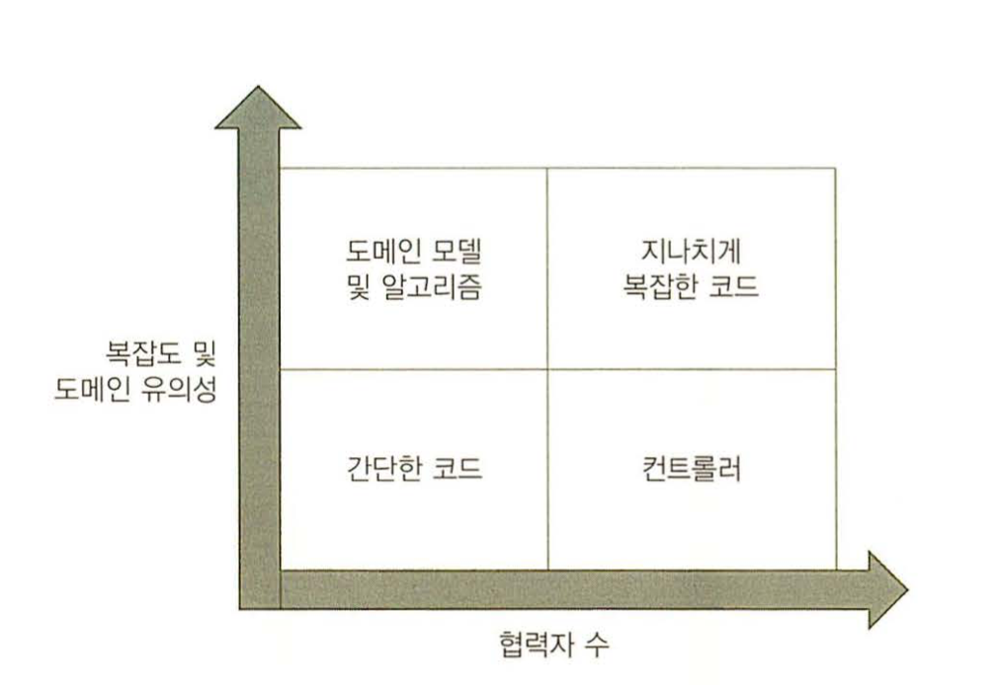
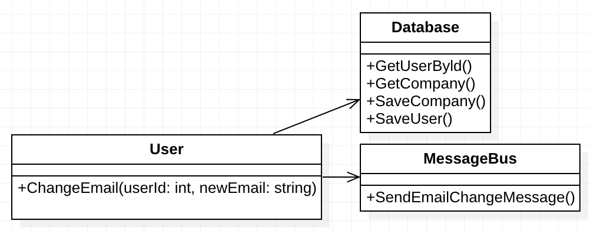
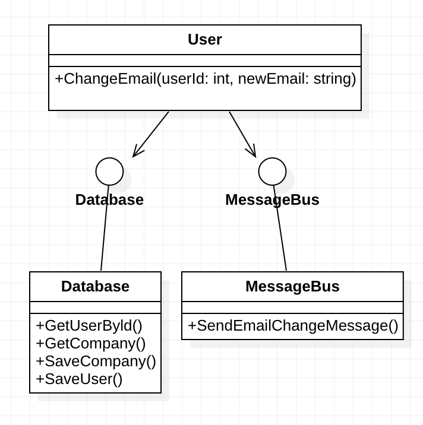
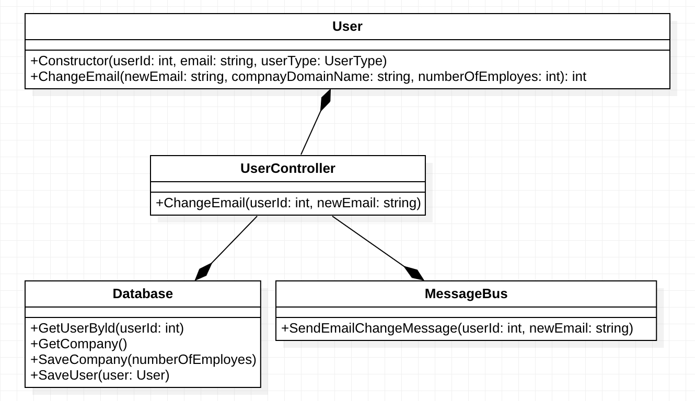
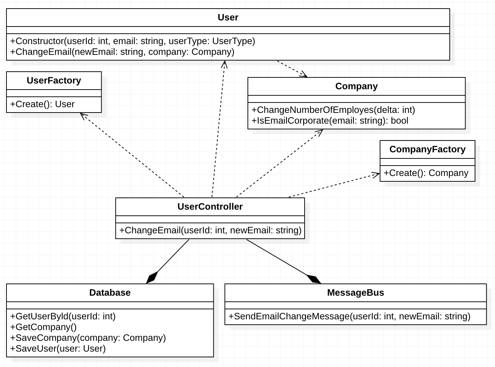
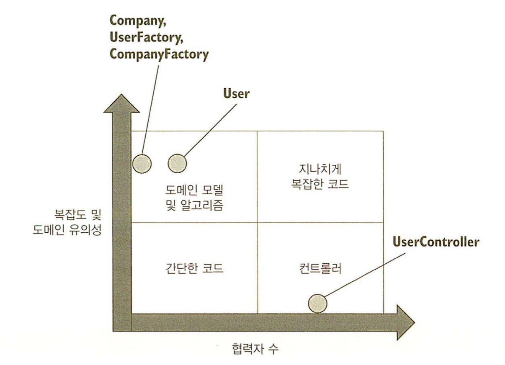
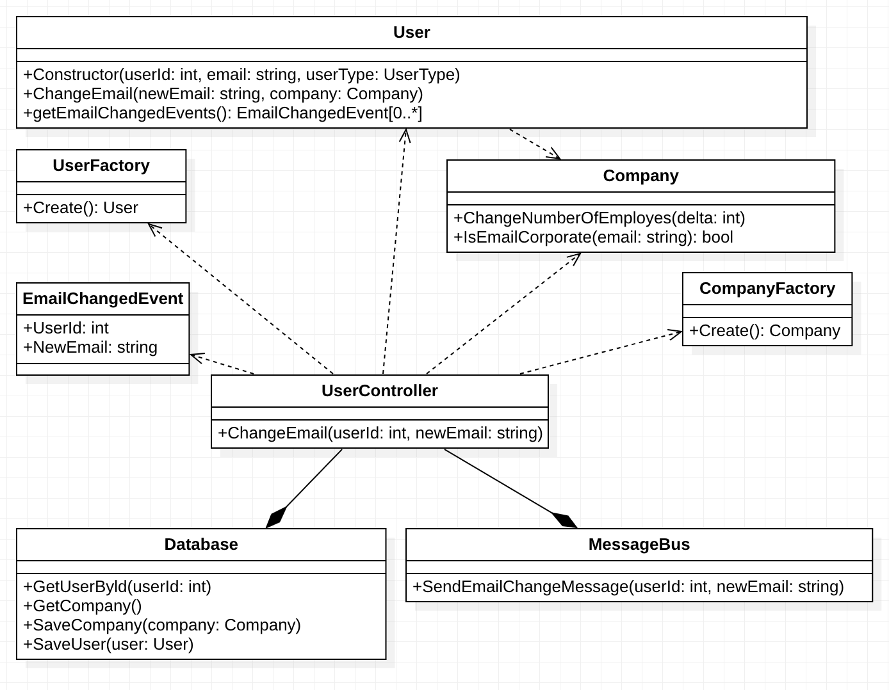

# 가치 있는 단위 테스트를 위한 리팩터링

## 리팩터링할 코드 식별하기
- 지나치게 복잡한 코드는 도메인 모델 및 알고리즘과 컨트롤러로 분리되도록 리팩토링 해야한다.

### 코드의 네 가지 유형
- 모든 제품 코드는 다음 두가지 기준으로 분류 할 수 있다.
    - 복잡도 또는 도메인 유의성
        - 복잡도는 코드 내 분기 수로 정의된다.
        - 복잡도를 계산하는 방법은 1 + 분기점 수
        - 순환 복잡도 라고 한다.
        - 최종 사용자의 목표와 가까운 코드일 수록 도메인 유의성이 높다.
        - 코드 복잡도가 높고 도메인 유의성으 높은 코드가 가장 단위 테스트 할만한 코드 라고 할 수 있다.
        - 하지만 꼭 코드가 복잡하지 않더라도 도메인 유의성이 높으면 테스트 할 만한 코드가 된다.
    - 협력자 수
        - 협력자가 많을 수록 테스트 코드에 많은 비용이 든다.
        - 도메인 모델에는 프로세스 외부 협력자를 사용하면 목을 유지하는데 많은 비용을 쓰게 된다.
    - 코드 복잡도, 도메인 유의성, 협력자 수의 관점에서 코드 유형은 다음과 같다.
    - 
    - 복잡도 및 도메인 유의성이 높고 협력자 수가 적은 좌측 상단을 단위테스트 하는 경우가 가장 노력대비 이롭다. 협력자가 없어 테스트를 구성하기 쉽고 도메인 유의성이 높은 코드를 테스트하기 때문에 회귀방지가 향상된다.
    - 간단한 코드는 테스트 가치가 없다.
        - 통합테스트의 일부로 테스트 되면 충분함.
    - 지나치게 복잡한 코드는 도메인 유의성이나 복잡도가 높아서 테스트가 필요하지만 협력자수가 많아서 테스트가 쉽지않고 비용이 많이 발생함.
        - 이러한 코드는 컨트롤러와 알고리즘이라는 두 부분으로 나누도록 리팩토링해야한다.

### 험블 객체 패턴으로 지나치게 복잡한 코드 분할
- 지나치게 복잡한 코드는 험블 객체 패턴으로 리팩터링 할 수 있다.
- 험블 객체는 비지니스 로직과 협력자를 서로 분리한뒤 험블 객체라는 객체를 만들어 둘을 결합하는 것을 일컷는다.
    - 결국 육각형 아키텍쳐의 형태로 리팩터링 하는것이다.

## 가치 있는 테스트를 위한 리팩터링

### 고객관리 시스템(CRM) 예시

사용자의 데이터는 데이터베이스에 저장한다.
시스템은 이메일 변경이라는 유즈케이스를 지원한다.
이메일 변경은 다음 규칙을 따른다.

- 사용자 이메일이 회사도메인에 속한경우 직원, 그렇지 않은 경우 고객이다.
- 시스템은 회사 직원수를 추적한다. 직원에서 고객으로 고객에서 지원으로 변경되는 경우에도 직원수의 변동이 필요하다.
- 이메일이 변경될 경우 시스템은 메세지 버스로 메세지를 보내 외부에 알린다.


#### 초기구현


- 초기구현은 User 클래스에서 ChangeEmail을 통해 모든 로직이 구현되어있고 외부 의존성에 변경및 조회도 수행하는 형태의 활성 레코드 패턴으로 만들어졌다.
- 협력자 수가 많고 사용자의 목표와 직접적인 연관이 있어 도메인 유의성이 높으므로 지나치게 복잡한 코드에 해당한다.

따라서 리팩터링 해보자면

#### 1단계 암시적 의존성을 명시적으로 만들기



- MessageBus와 Database의 인터페이스를 만들고 User에 주입하는 형태를 구성할 수 있다.
- User에 주입하는 형태이기 때문에 테스트에서 Database와 MessageBus에 대한 목을 만들어 주입할 수 있다.
- 이 방식은 목을 사용하기에 테스트에 목에대한 유지비가 증가한다.
- 결과적으로 도메인 모델이 외부 의존성에 의존하지 않는 편이 깔끔하다.

#### 2단계 어플리케이션 서비스 계층 도입.



- 험블컨트롤러를 통해 외부 의존성으로부터 도메인을 분리했다.
- 하지만 다음과 같은 문제가 있다.
    - 프로세스 외부 의존성이 주입되지 않고 컨트롤러에서 직접 인스턴스화 된다. 이렇게 할경우 통합테스트 작성에서 문제가 발생한다.
    - 컨트롤러는 데이터베이스에서 받은 원시 데이터를 User로 구성해서 생성하는데 이것은 오케스트레이션에 역할에 해당하지 않는 복잡한 로직이다.
    - 또한 User에서 ChangeEmail을 수행할 경우 업데이트된 직원수를 반환하는데 이것은 사용자와는 관련없는 데이터로 다른 곳에 책임이 있어야할것으로 보인다.
    - 컨트롤러는 이메일이 이전과 다른지 알 수 있는 방법이 없기 때문에 무조건 메세지 버스로 알람을 보내고 데이터베이스를 업데이트한다.
- User의 경우는 협력자수가 없어졌기 때문에 테스트하기 용이한 코드가 되었다. 하지만 UserController의 경우 아직 복잡하다.

#### 3단계 어플리케익션 서비스 복잡도 낮추기.
- UserController의 복잡성을 낮추기 재구성 로직을 추출해야하는데 이를 위해 위해서는 ORM을 사용할 수 있다.
- ORM을 사용하지 않을경우 팩토리를 작성할 수 있다.

```
class UserFactory {    
public:
    static User Create(object[] data) const {
        Precondition.Require(data.Length >= 3);

        int id = (int)data[0];
        string email = (string)data[1];
        UserType type = (UserType)data[2];

        return new User(id, email, type)
    }
};
```
- 이렇게 구성해 두면 협력자로 부터 재구성 로직이 분리 되기 때문에 테스트하기 쉬워진다.
- 이 로직은 사용자 이메일을 변경하려는 클라이언트의 목표와는 직접적인 관련이 없는 유틸리티 코드이다.

#### Company 클래스 분리.
- User에서 업데이트된 직원수를 반환하는것은 해당 도메인모델의 책임과는 관련이 없어보인다. 이것을 해결하기위해 새롭게 Company 클래스를 만든다.



- Company에 대한 클래스를 생성하여 회사에대한 판단과 직원수 변동에 대한 책임을 User에서 Company로 이전하였다.
- User가 Company를 참조하여 협력자 수가 늘어났지만 외부 프로세스 의존성이 아니기 때문에 테스트가 복잡해진것은 아니다.
- UserController에서 재구성 로직이 Factory 클래스로 분리되어 UserController는 오케스트레이션만 수행 할 수 있게되어 복잡도 및 도메인 유의성이 많이 낮졌다.
- 결론적으로 각 클래스가 위치하는 사분면은 다음과 같다.



## 최적의 단위테스트 커버리지 분석

위에서 수행한 CRM의 리펙터링한 코드에서 어떤 코드를 어떻게 테스트해야하는지 알아본다.

- 도메인 계층과 유틸리티 코드 테스트
    - User와 Company의 경우가 해당한다.
    - 복잡도나 도메인 유의성이 높아 회귀 방지가 뛰어나고 협력자가 없어 유지비도 낮다.
- 간단한 코드
    - 간단한 코드는 테스트할 가치가 없다.
        - 단순 할당문만 있는 생성자의 경우가 해당함.
- 전제조건
    - 도메인 유의성에 해당하는 모든 전제조건은 테스트가 필요하다.
        - ex> 직원수 변경시 회사의 직원수는 0 보다 커야한다.
    - 반면 유틸리티 같은 도메인 유의성에 해당하지 않는 전제조건은 테스트할 가치가 없다.

## 컨트롤러에서 조건부 로직 처리
- 비지니스 로직과 오케스트레이션의 분리는 다음 3단계로 진행될때 가장 효과적임
    1. 저장소에서 데이터 검색
    1. 비지니스 로직 실행
    1. 데이터를 저장소에 저장.
- 하지만 이러한 형태가 아니고 도메인 모델의 처리 결과에 따라 한번더 데이터를 조회해야하는 경우가 생길 수 있음.
    1. 저장소에서 데이터 검색
    1. 비지니스 로직 실행
    1. 비지니스 로직 결과 기반으로 저장소에서 데이터 검색
    1. 비지니스 로직 실행
    1. 데이터를 저장소에 저장.
- 이럴 경우 오케스트레이션에서 도메인에대한 세부정보를 알기 힘들기 때문에 데이터를 읽고 쓰는것이 효율적이지 않다. 해결법으로는 다음이 제시된다.
    - 외부에 대한 모든 읽기와 쓰기를 가장자리로 밀어내기
        - 필요 없는 경우에도 판단이 불가하기 때문에 일단 읽거나 쓰기 때문에 성능이 저하된다.
        - 대부분의 어플리케이션은 성능이 중요하므로 사용 할 수 없다.
    - 도메인 모델에서 프로세스 외부 의존성을 주입한다. 도메인이 직접 시점을 결정할 수 있다.
        - 목에 대한 유지보수 비용이 커진다. 따라서 가능하면 피하도록 한다.
    - 의사 결정 프로세스를 더욱 세분화 하고 단계별로 컨트롤러를 실행한다.
        - 컨트롤러가 상대적으로 단순하지 않다. 세부단계를 관리하려면 컨트롤러에 의사결정 지점이 생긴다.
        - 컨트롤러가 복잡해지지만 CanExecute/Execute 패턴등을 사용하여 복잡도를 관리하는것이 가능하다.

### CanExecute/execute 패턴
이 패턴은 단순하게 도메인 모델에게 명령을 수행해도 되는지 뭇는 패턴이다.

```
class Divide {
    int _value;
    int _denominator;
    Divide(int value, int denominator) {
        _value = value;
        _denominator = denominator;
    }

    int Do() const {
        return _value/_denominator
    }
    bool CanDo() const {
        return _denominator != 0;
    }
};
```

사용시
```
Divide v = Divide(100, 0);
if (v.CanDo()) {
    v.Do();
}
```

- 실행 가능여부를 캡슐화 할 수 있어 의사결정을 도메인 모델에 맡기고 사용하는 쪽의 의사결정 코드를 단순화 할 수 있다.
    - 도메인 계층에 모든 의사결정 로직이 있기 때문에 Controller에 분기가 있더라도 테스트 하지 않아도 된다.
- 따라서 의사 결정 프로세스를 더욱 세분화하고 CanExecute/Excute 패턴등을 활용하여 Controller의 의사결정을 최대한 단순하게 만들어 줄 수 있다.

## 도메인 이벤트를 사용해 도메인 모델의 변경 사항 추적



- 도메인 이벤트는 도메인 모델의 변경이 발생했을 때만 외부 의존성에 저장하거나 통신하는 형태로 구성하기 사용한다.
- 즉 "컨트롤러는 이메일이 이전과 다른지 알 수 있는 방법이 없기 때문에 무조건 메세지 버스로 알람을 보내고 데이터베이스를 업데이트한다."를 해결하기 위한 방법에 대한 설명.
- 구조는 단순하다 User객체에서 이메일 변경이 발생하면 EmailChangedEvent 객체를 만들어 도메인 모델에 저장한다.
- 이후 UserController는 User의 getEmailChangedEvents()를 얻어 MessageBus에 이벤트를 발송한다.
- UserController에서는 MessageBus에 메세지를 전달해야하는지 판단할 필요가 없이 단순히 User 도메인 모델로부터 이벤트가 있는지 검사하여 메세지를 보내기만 하면 된다.


## 개인적인 정리
- 실제 코드를 기반으로 설명하기 시작하니 정리가 많이 어려워졌다.
- 따라서 해당 코드를 다이어그램으로 바꾸고 구조를 중점으로 설명하려고 노력했다.
- 최근 개발한 프로젝트들이 대부분 DI를 통해 구현되어있는데 확실히 목을 구성하는게 테스트 유지보수에 큰 영향을 주는것같다.
    - 지금 진행 중인 프로젝트를 출력기반의 테스트로 리팩토링 하는것을 고려해봐야할듯.
- 결과적으로 컨트롤러를 구성하더라도 분기와 반복을 최대한 단순한 형태로 사용가능하도록 도메인 모델을 캡슐화하는것이 핵심이다.
- 발송전 이벤트 병합 : https://enterprisecraftsmanship.com/posts/merging-domain-events-dispatching/
- 결과적으로 비즈니스 로직과 오케스트리에션을 분리하는 방법을 배운거같다.
    - 사이드 이팩트가 필요하더라도 도메인 모델에서는 일으키지 말고 메모리만으로 유지하다가 컨트롤러에서 비즈니스 연산이 끝난뒤 일으켜야한다.
    - 이러한 방식을 사용할때 도메인 모델이 복잡해 질 수 있으니 도메인 모델을 단순화하는데 많은 고민을 해라 라는 내용이었던것같다.